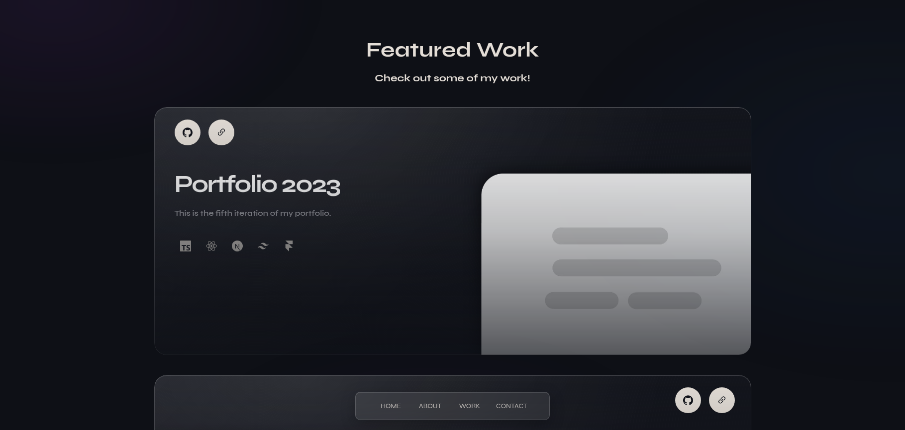
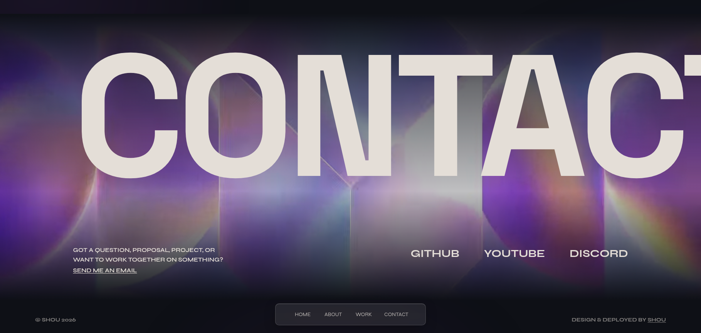

# Portfolio v6

The sixth version of this portfolio, rewritten as a static site. Same design,
same content, 2.8 kB of JavaScript instead of 180 kB.

Why bundle so much useless stuff if i just want to have a functional and fast portfolio? Life can be so easy sometimes...

[Version 5](https://github.com/nuIIpointerexception/www.seekvisualartist.com) was a
Next.js and React app that needed a server or a static export. This version is
HTML and CSS with behavior written as custom elements.

Live at [shou.work](https://shou.work/).

---

## Showcase

<div>
    
    <br>
    
    <br>
    
</div>

---

## Measurements

| | v5 | v6 |
|---|---:|---:|
| Initial JavaScript | 181,997 bytes | **2,751 bytes** |
| Largest Contentful Paint | 232 ms | **48 ms** |
| Cumulative Layout Shift | 0.514 | **0.000** |
| Runtime dependencies | 17 | **0** |

Measured locally in headless Chromium at 390x844, median of nine runs per
version. These are numbers from my machine, not web vitals.

---

## Prerequisites

- [Bun](https://bun.sh/) 1.4.2 or newer
- [Node.js](https://nodejs.org/en/) 22.12.0 or newer

---

## Building

1. Clone the repository

    ```bash
    git clone https://github.com/nuIIpointerexception/shou.work.git
    ```

2. Install dependencies

    ```bash
    bun install
    ```

3. Run the development server

    ```bash
    bun run dev
    ```

Commands:

```bash
bun run build       # Build static files into dist/
bun run preview     # Preview the production build
bun run check       # Run Oxlint
bun run typecheck   # Check TypeScript
```

---

## Deployment 📦

`bun run build` writes a complete static site to `dist/`. The site runs on
[Cloudflare Workers](https://workers.cloudflare.com/) with static assets:

- Build command: `bun run build`
- Deploy command: `npx wrangler deploy`
- Build environment variable: `BUN_VERSION=1.4.2`

`wrangler.jsonc` points the Worker at `dist/` as its assets directory, so the
built site is served without a Worker script. `not_found_handling` is set to
`404-page` so the hand-written `404.html` is served for unknown paths. Using
`single-page-application` here would return `index.html` for every unknown URL
and the 404 page would never appear.

The project is a Worker named `www-shou-work`, not a legacy Pages project.
`wrangler pages deploy` fails against it because no Pages project by that name
exists in the account.

---

## Tech used 🛠️

- [Vite](https://vite.dev/) - Bundler
- [Lightning CSS](https://lightningcss.dev/) - CSS transformer and minifier
- [TypeScript](https://www.typescriptlang.org/) - Typing
- Native [Custom Elements](https://developer.mozilla.org/en-US/docs/Web/API/Web_components/Using_custom_elements) - Behavior
- [Bun](https://bun.sh/) - Task runner
- [Oxlint](https://oxc.rs/) - Linter
- [Cloudflare Workers](https://workers.cloudflare.com/) - Hosting

---

## License 📄

[MIT](LICENSE) — use it, change it, ship it.
